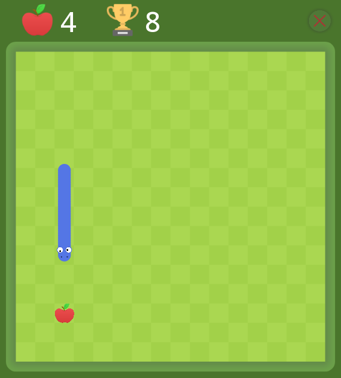

# Snake-SFML

---

## Gra snake napisana w C++ z wykorzystaniem biblioteki SFML.

Gra posiada funkcjonalności takie same jak tradycyjny snake. Zjedzenie jabłka wydłuża węża. Uderzenie w samego siebie lub ścianę kończy grę.

Dodatkowo gra posiada zapis najlepszego osiągniętego wyniku.